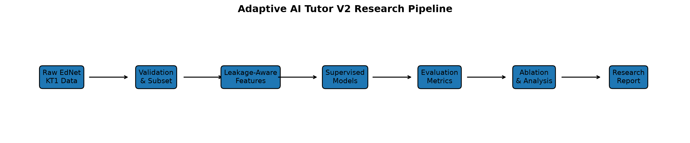
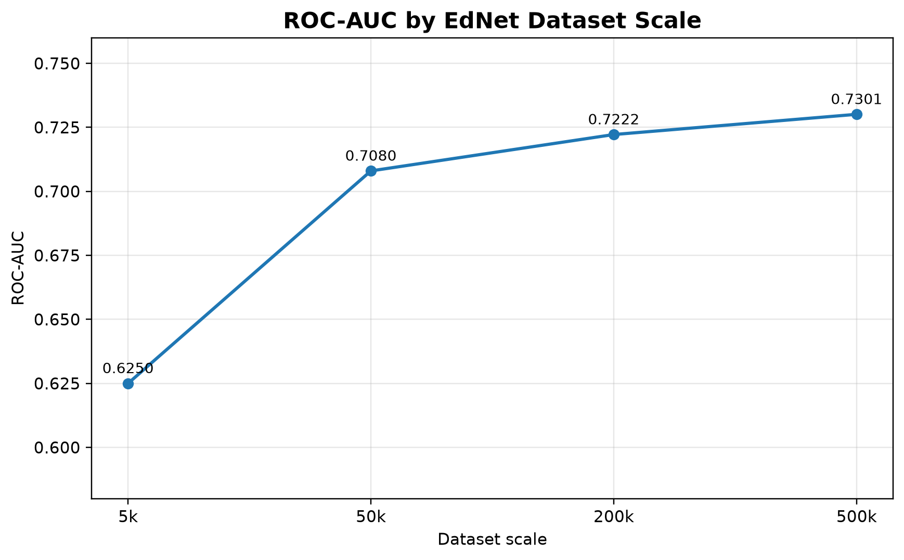
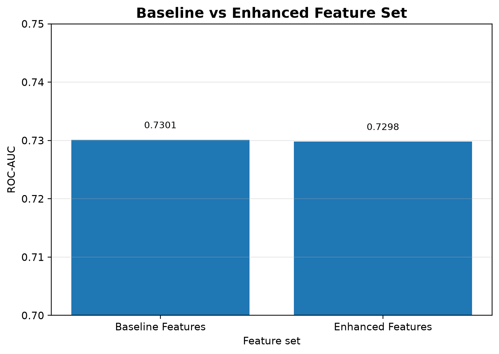
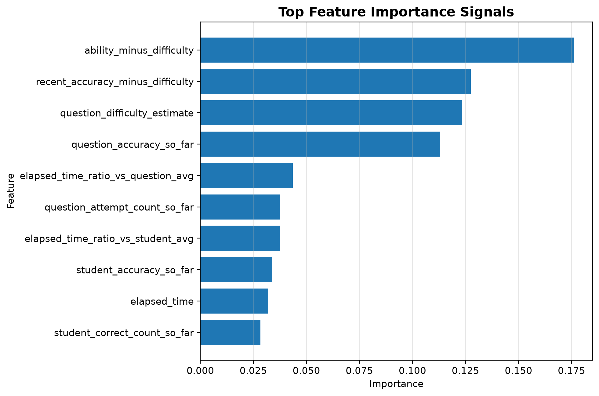
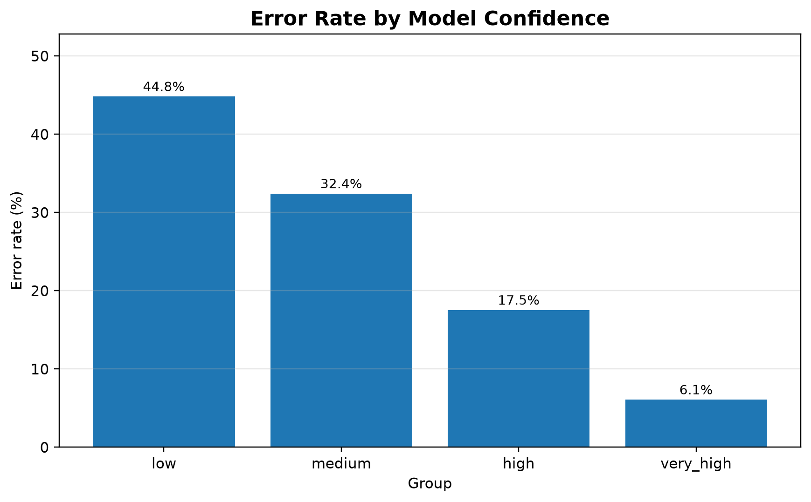
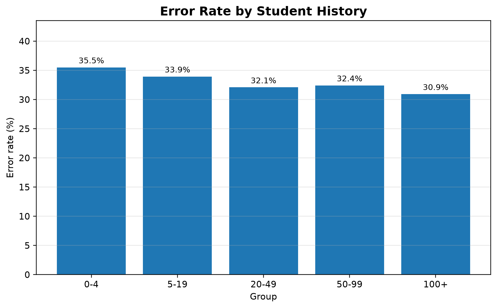
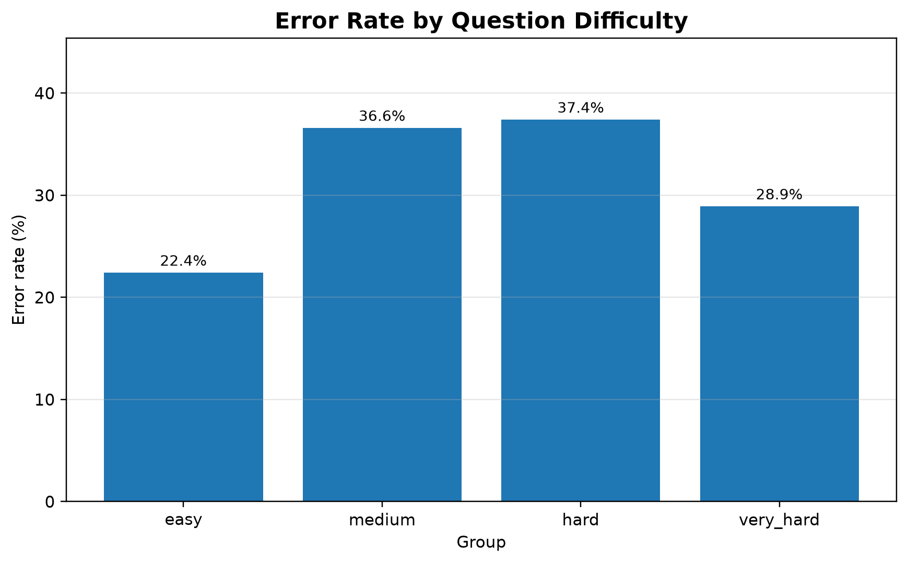

# Adaptive AI Tutor Research Lab

**Adaptive AI Tutor Research Lab** is an applied AI/ML research portfolio project that investigates how intelligent tutoring systems can personalize learning using student interaction data, knowledge tracing-inspired features, supervised learning, clustering, recommendation strategies, reinforcement learning, and real-data validation.

The project started as a synthetic end-to-end prototype and was later extended to the **EdNet KT1** educational dataset for real-world correctness prediction.

## Project Goal

The main goal is to study how an AI tutor can use student interaction history to support better personalized learning decisions.

The project explores questions such as:

- Can we predict whether a student will answer a question correctly?
- Can we model student knowledge using previous learning interactions?
- Can we group students by learning behavior?
- Can we recommend learning activities based on weaknesses and question difficulty?
- Can reinforcement learning improve tutor decisions compared with a random policy?
- Does model performance improve as real student interaction history increases?

## Why This Project Matters

Educational platforms generate large amounts of interaction data, but the core challenge is turning that data into useful learning decisions.

This project demonstrates how multiple AI/ML components can be connected into one adaptive learning pipeline:

```text
data validation → feature engineering → correctness prediction → clustering → recommendation → reinforcement learning → evaluation → reporting → demo
```

The project is not only a model-training notebook. It includes:

- structured project architecture
- reproducible scripts
- leakage-aware feature engineering
- supervised learning baselines
- scale experiments on real educational data
- ablation analysis
- feature importance
- error analysis
- clustering and recommendation logic
- reinforcement learning simulation
- Streamlit demo
- research-style documentation
- ethics and limitations discussion

## Current Version

The repository contains two main stages:

### V1: Synthetic Adaptive Tutor Prototype

The first version uses synthetic student interaction data to build and test the full adaptive tutor pipeline safely.

Synthetic data is used to:

- avoid privacy risks
- make the first prototype reproducible
- test the full ML pipeline before using real datasets
- simulate student behavior, question difficulty, recommendations, and reinforcement learning decisions

### V2: Real-Data Validation with EdNet

The second version extends the project to real educational data using the **EdNet KT1** dataset.

The main V2 task is **student correctness prediction**:

> Predict whether a student will answer a question correctly based on previous interaction history and question-level signals.

Raw EdNet data is kept local and is not committed to GitHub.

## V2 Dataset

- Dataset: EdNet KT1
- Scope: KT1 student interaction files + `contents/questions.csv`
- Raw data size: local only, not committed
- Target variable: `is_correct = user_answer == correct_answer`
- Final real-data subset: 500,057 interactions

## Main Results

| Stage | Data Source | Interactions | Best Model | ROC-AUC |
|---|---|---:|---|---:|
| V1 Synthetic | Synthetic prototype data | 1,452 | Logistic Regression | 0.9077 |
| EdNet 5k | Real EdNet KT1 | 5,017 | Gradient Boosting | 0.6250 |
| EdNet 50k | Real EdNet KT1 | 50,081 | Gradient Boosting | 0.7080 |
| EdNet 200k | Real EdNet KT1 | 200,091 | Gradient Boosting | 0.7222 |
| EdNet 500k Final | Real EdNet KT1 | 500,057 | Gradient Boosting | 0.7301 |

The results show that model performance improved as the real EdNet subset size increased. This suggests that the pipeline benefits from larger student interaction histories.

## Feature Ablation

A leakage-free enhanced feature set was tested against the baseline feature set.

| Feature Set | Best Model | Accuracy | F1 | ROC-AUC | Log Loss |
|---|---|---:|---:|---:|---:|
| Baseline Features | Gradient Boosting | 0.6799 | 0.7523 | 0.7301 | 0.5939 |
| Enhanced Features | Random Forest | 0.6771 | 0.7557 | 0.7298 | 0.5956 |

The enhanced feature set achieved comparable performance but did not produce a meaningful ROC-AUC improvement. This suggests that the baseline history-based features were already strong for this task.

## Key Research Findings

- Real-data performance improved from ROC-AUC `0.6250` at 5k interactions to `0.7301` at 500k interactions.
- The strongest predictive signals were related to the relationship between student ability and question difficulty.
- The model became more reliable when more student history was available.
- Model confidence was strongly related to prediction accuracy.
- Additional leakage-free feature engineering was tested, but the baseline feature set remained slightly stronger.

## Feature Importance

The strongest predictive features in the enhanced analysis were:

1. `ability_minus_difficulty`
2. `recent_accuracy_minus_difficulty`
3. `question_difficulty_estimate`
4. `question_accuracy_so_far`
5. `elapsed_time_ratio_vs_question_avg`

This supports the educational interpretation that correctness prediction depends strongly on the match between a student's recent performance and the estimated difficulty of the question.

## Error Analysis

The model became more reliable when more student history was available:

| Student History | Error Rate |
|---|---:|
| 0-4 attempts | 35.5% |
| 5-19 attempts | 33.9% |
| 20-49 attempts | 32.1% |
| 50-99 attempts | 32.4% |
| 100+ attempts | 30.9% |

Model confidence was also strongly related to prediction accuracy:

| Confidence Group | Error Rate |
|---|---:|
| Low | 44.8% |
| Medium | 32.4% |
| High | 17.5% |
| Very High | 6.1% |


## Visual Results

The EdNet V2 analysis includes final visual outputs for the research report.

### Research Pipeline



### ROC-AUC by Dataset Scale



### Feature Ablation



### Feature Importance



### Error Analysis







## Main Components

### 1. Data Preparation

The project includes scripts for:

- synthetic data generation
- EdNet file inspection
- EdNet schema validation
- EdNet subset preparation
- dataset validation

### 2. Feature Engineering

Features include:

- student accuracy so far
- rolling accuracy
- student streaks
- elapsed time statistics
- question accuracy so far
- question difficulty estimate
- activity gaps
- ability-minus-difficulty signals
- tag and part metadata

All history-based features are designed to avoid using the current row's correctness as input.

### 3. Supervised Knowledge Tracing Baselines

The supervised learning task predicts whether a student will answer a question correctly.

Models include:

- Dummy Majority Classifier
- Logistic Regression
- Random Forest
- Gradient Boosting
- Histogram Gradient Boosting

Metrics include:

- Accuracy
- Precision
- Recall
- F1 Score
- ROC-AUC
- Log Loss

### 4. Student Clustering

Students are grouped based on learning behavior, including:

- total attempts
- final accuracy
- average elapsed time
- topic diversity
- recent accuracy
- progress trend

### 5. Recommendation System

The project includes simple recommendation strategies:

- random recommendation
- difficulty-based recommendation
- weak-topic recommendation

These strategies simulate how an AI tutor might select the next learning activity.

### 6. Reinforcement Learning Tutor

A Q-learning tutor is implemented in the synthetic prototype.

The tutor observes a student state, chooses an action, receives reward, and learns which question difficulty may work better.

Actions:

- easy question
- medium question
- hard question

The Q-learning tutor is compared against a random policy.

### 7. Evaluation and Reporting

The repository includes result tables and reports for:

- supervised model comparison
- EdNet scale experiments
- feature ablation
- feature importance
- error analysis
- student clustering
- recommendation examples
- reinforcement learning policy comparison

### 8. Streamlit Demo

The project includes a Streamlit dashboard that displays:

- dataset overview
- supervised model results
- clustering results
- recommendation examples
- reinforcement learning comparison

## Project Structure

```bash
adaptive-ai-tutor-research-lab/
├── 00_project_charter/
├── 01_research/
├── 02_data/
├── 03_notebooks/
├── 04_src/
│   ├── data/
│   ├── features/
│   ├── models/
│   ├── rl/
│   ├── evaluation/
│   └── visualization/
├── 05_experiments/
├── 06_results/
│   ├── reports/
│   └── tables/
├── 07_demo/
├── 08_report/
├── 09_portfolio_assets/
├── 10_docs/
├── tests/
├── run_pipeline.py
├── requirements.txt
└── README.md
```

## How to Run the Project

### 1. Create and activate a virtual environment

```bash
python3 -m venv .venv
source .venv/bin/activate
```

### 2. Install dependencies

```bash
pip install -r requirements.txt
```

### 3. Run the synthetic V1 pipeline

```bash
python run_pipeline.py
```

### 4. Run tests

```bash
pytest
```

### 5. Launch the Streamlit demo

```bash
streamlit run 07_demo/app.py
```

### 6. Run EdNet V2 scripts

EdNet raw data must be downloaded locally first. Raw files are intentionally excluded from GitHub.

Example V2 workflow:

```bash
python 04_src/data/validate_ednet_dataset.py
python 04_src/features/build_ednet_features.py
python 04_src/models/ednet_supervised_baselines.py
python 04_src/features/build_ednet_features_v2.py
python 04_src/models/ednet_enhanced_models.py
python 04_src/evaluation/compare_ednet_feature_sets.py
python 04_src/evaluation/analyze_ednet_feature_importance.py
python 04_src/evaluation/analyze_ednet_errors.py
python 04_src/evaluation/build_final_v1_v2_comparison.py
```

## Important Outputs

| File | Purpose |
|---|---|
| `06_results/tables/ednet/final_v1_v2_comparison.csv` | Main V1 vs V2 comparison table |
| `06_results/tables/ednet/ednet_feature_ablation_500k.csv` | Baseline vs enhanced feature ablation |
| `06_results/tables/ednet/ednet_feature_importance.csv` | Feature importance analysis |
| `06_results/tables/ednet/ednet_error_analysis.csv` | Error analysis by groups |
| `06_results/reports/final_ednet_v2_report.md` | Research-style final V2 report |

## Technologies Used

- Python
- pandas
- NumPy
- scikit-learn
- matplotlib
- Streamlit
- pytest
- Git / GitHub

## Research Position

This project is best described as a **strong applied machine learning research portfolio project** in educational data mining.

It demonstrates:

- real educational dataset validation
- leakage-aware feature engineering
- supervised ML baselines
- scale experiments
- ablation analysis
- feature importance
- error analysis
- recommendation and reinforcement learning prototypes
- research-style documentation

It does not claim to introduce a new knowledge tracing algorithm.

## Limitations

Current limitations include:

- no Deep Knowledge Tracing baseline yet
- no SAKT or Transformer-based KT comparison yet
- probability calibration has not yet been applied
- some model probability estimates appear overconfident
- real-data validation focuses on correctness prediction rather than long-term learning outcomes
- the reinforcement learning tutor is currently simulated in the synthetic prototype

## Future Work

Future improvements may include:

- Deep Knowledge Tracing
- SAKT
- Transformer-based Knowledge Tracing
- probability calibration
- student cold-start analysis
- question cold-start analysis
- stronger recommender systems
- more realistic reinforcement learning environments
- fairness evaluation
- explainable AI methods
- improved interactive tutor demo

## Ethics and Responsible Use

AI tutoring systems should support students and teachers, not replace human judgment or make high-stakes educational decisions automatically.

Predictions should be treated as decision-support signals, especially because educational data can contain bias, missing context, and unequal learning opportunities.

Raw educational data is intentionally kept local and excluded from GitHub.

## Status

Current status: **V2 real-data validation completed and pushed to GitHub main.**

The project includes a working synthetic prototype, real EdNet correctness prediction experiments, scale validation, ablation analysis, feature importance, error analysis, result tables, and a research-style final report.
